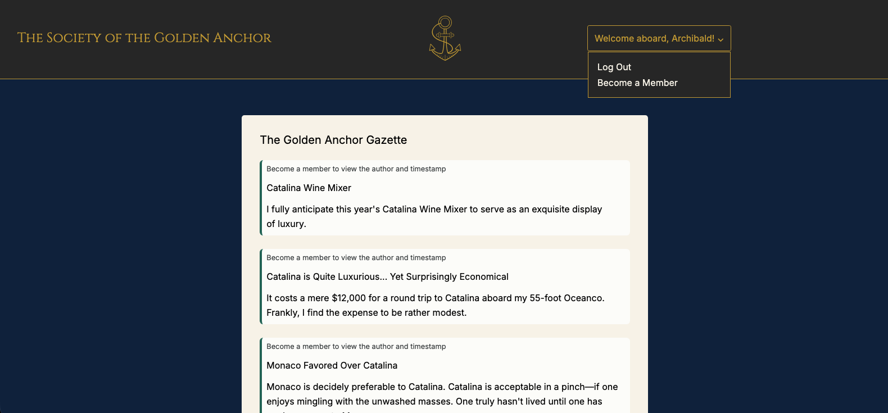
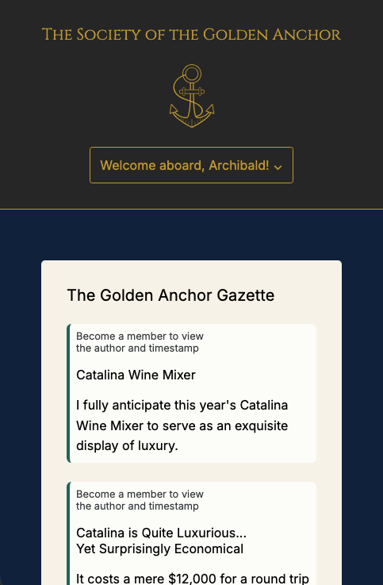

# 👑 Members Only

A member-based messaging app built with Node.js, Express, PostgreSQL, EJS, and Passport.js. This project was created to explore my understanding of user authentication and authorization.

## 🚀 Live Deployment

https://members-only-i18d.onrender.com/

## 📋 Overview

This application allows:

- Users to sign up for an account
  - Signing up gives user ability to post on the message board but post authors and timestamps will remain hidden
- Upgrade to member upon entering the secret password
  - Member accounts can see the author/timestamp of each message
- Upgrade to admin account upon enterin the secret password
  - Members can upgrade to admin account, providing them the ability to Delete messages from the message board

## 👨‍💻 Technologies Used:

- Node.js
- Express
- PostgreSQL
- EJS
- Passport.js
- HTML
- CSS
- JavaScript
- express-validator
- express-session

## ✨ Features

- User sign-up
- Add messages to message board
- Member Upgrade
- Admin Upgrade
- Ability to delete messages if Admin

## 👨‍🎓 What I Learned

- How to configure a session via passport.js
- How to manage user authorization

## 📺 Screenshots

Desktop:

Tablet:

Mobile:

